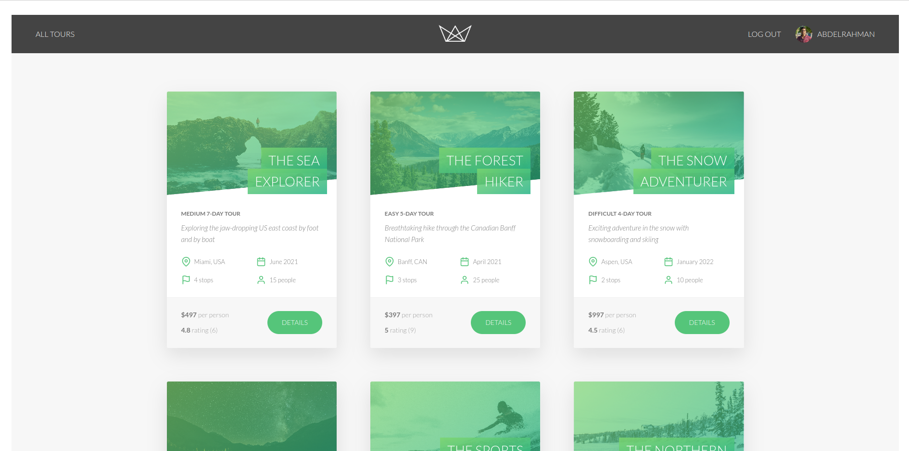
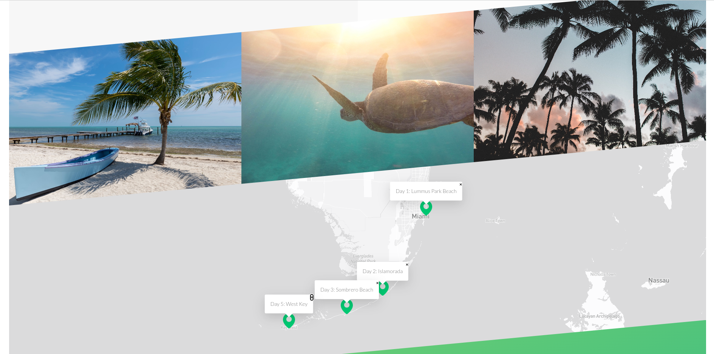
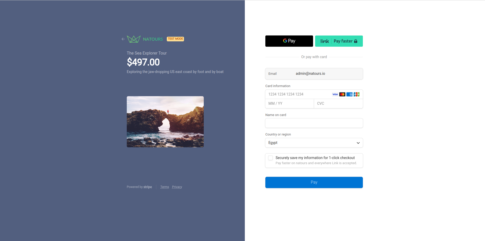
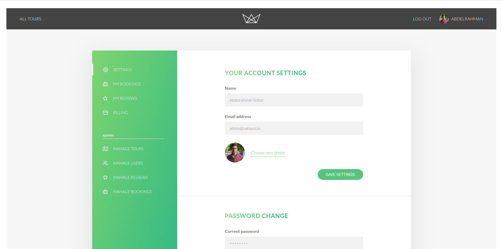

# Natours

<div id="top"></div>


<!-- PROJECT LOGO -->
<div align="center">
<br>
<a href="https://natours-abdelrahman-soltan.up.railway.app/">
    
  </a>
<br>
<br>

  <p align="center">
  <a href="https://natours-abdelrahman-soltan.up.railway.app/">View Demo</a>
    ·
    <a href="https://github.com/abdrahmansoltan/Natours/issues">Report Bug</a>
  </p>
</div>

<!-- TABLE OF CONTENTS -->
<details>
  <summary>Table of Contents</summary>
  <ol>
    <li>
      <a href="#about-the-project">About The Project</a>
      <ul>
        <li><a href="#features">Features</a></li>
        <li><a href="#built-with">Built With</a></li>
      </ul>
    </li>
    <li><a href="#how-to-use">How to use</a></li>
    <li>
      <a href="#getting-started">Getting Started</a>
      <ul>
        <li><a href="#installation">Installation</a></li>
        <li><a href="#ports-and-endpoints">Ports and EndPoints</a></li>
      </ul>
    </li>
    <li><a href="#contributing">Contributing</a></li>
  </ol>
</details>

<!-- ABOUT THE PROJECT -->

## About The Project

Natours is a tours booking website, where users can browse tours, book tours, and pay for them using stripe payment gateway. It's a full-stack project, built using the Node.js.

> The documentation of the API for this app can be found at [Natours API Documentation](https://documenter.getpostman.com/view/20414422/2s93K1oz6Z)






### Features

- **Users:** Authentication and Authorization using JWT

  - Users can sign up with the application.
  - Users can log into the application.
  - Users can log out of the application.
  - A user can be either a regular user or an admin or a lead-guide or a guide.
  - When you sign up, you are a regular user by default.
  - User profile management
    - Users can update their password.
    - Users can reset their password
    - Users can update their general information.
    - Users can see their profile page.

- **Tours**
  - Manage booking, check tours map, check users' reviews and rating for each tour
  - Tours can be created by an admin user or a lead-guide.
  - Tours can be seen by every user.
  - Tours can be updated by an admin user or a lead-guide.
  - Tours can be deleted by an admin user or a lead-guide.
- **Bookings**
  - Only regular users can book tours (make a payment).
  - Regular users can not book the same tour twice.
  - Regular users can see all the tours they have booked.
  - An admin user or a lead-guide can see every booking on the app.
  - An admin user or a lead-guide can delete any booking.
  - An admin user or a lead-guide can create a booking (manually, without payment).
  - An admin user or a lead-guide can not create a booking for the same user twice.
  - An admin user or a lead-guide can edit any booking.
- **Reviews**

  - Only regular users can write reviews for tours which they have booked.
  - All users can see the reviews of each tour.
  - Regular users can edit and delete their own reviews.
  - Regular users can not review the same tour twice.
  - An admin can delete any review.

- **Payment**
  - Credit card Payment using Stripe

### Built With

- `HTML` (Create the structure and content of the web pages).
- `CSS` (Styling of the web pages).
- `PUG` (Template engine for generating the web pages dynamically).
- `JAVASCRIPT` (Interactivity, as well as making requests to the API from the client-side).
- `NODE` (Run JavaScript code on the server-side).
- `EXPRESS` (Node framework, meant to simplify the process of building complex server-side applications).
- `MONGODB` (Database for data persistence).
- `MONGOOSE` (Interacting with mongodb).
- `MAPBOX` (Displaying the different locations of each tour).
- `STRIPE` (Making payments on the app).
- `JSON WEB TOKEN` (Authenticating users)
- `NODEMAILER` (Sending emails to users of the app)
- `MAILTRAP` (Trapping the emails we send in our development environment, so they don't actually get sent to the user's email address)
- `Railway` (for deployment)

<p align="right">(<a href="#top">back to top</a>)</p>

---

## How to use

### users : (you can use these users to login)

| Email              | Password |
| ------------------ | -------- |
| loulou@example.com | test1234 |
| leo@example.com    | test1234 |
| eliana@example.com | test1234 |

#### Validation

- **Email validation**: as per **RFC2822** standards.
- **Password validation**:
  - The password must be more than **8** characters.

### Book a tour

- Login to the site

- Search for tours that you want to book
- Book a tour
- Proceed to the payment checkout page
- Enter the card details (Test Mood):

  ```
  - Card No. : 4242 4242 4242 4242
  - Expiry date: 02 / 22
  - CVV: 222
  ```

- Done!

### Manage your booking

- Check the tour you have booked in "My Bookings" page in your user settings. You'll be automatically redirected to this
  page after you have completed the booking.

### Update your profile

- You can update your own username, profile photo, email and password.

<p align="right">(<a href="#top">back to top</a>)</p>

---

<!-- GETTING STARTED -->

## Getting Started

This project require some perquisites and dependencies to be installed, you can find the instructions below

This project require some perquisites and dependencies to be installed, you can view it online using this [demo](https://natours-abdelrahman-soltan.up.railway.app/). or you can find the instructions below:

> To get a local copy, follow these simple steps :

### Installation

#### installing Locally

1. Clone the repo

   ```sh
   git clone https://github.com/abdrahmansoltan/Natours.git
   ```

2. go to project folder

   ```sh
   cd Natours
   ```

3. install dependencies

   ```sh
   npm install
   ```

4. Environmental Variables Set up

   - Here are the environmental variables that needs to be set in the **`config.env`** file in the main directory.
   - These are the default setting that I used for development, but you can change it to what works for you.

   ```
    JWT_SECRET=<any secret value of your choice>
    NODE_ENV=development
    PORT=3000
    DATABASE=<Your mongodb database url>
    USERNAME=<Your mongodb database username>
    DATABASE_PASSWORD=<Your mongodb database password>
    JWT_SECRET=<any secret value of your choice>
    JWT_EXPIRES_IN=90d
    JWT_COOKIE_EXPIRES_IN=90
    EMAIL_HOST=sandbox.smtp.mailtrap.io
    EMAIL_PORT=2525
    EMAIL_USERNAME=<Your mailtrap username>
    EMAIL_PASSWORD=<Your mailtrap password>
    EMAIL_FROM=<Your sender email>
    STRIPE_SECRET_KEY=<Your stripe secret key>
   ```

   - **Note:** You should also replace the (stripe publishable key) with your own publishable key in the [public/js/stripe.js](public/js/stripe.js) file.

5. Run development server

   ```sh
   npm run watch:js & npm run dev
   ```

---

### Ports and EndPoints

#### Ports

- BackEnd Development Server runs on port `3000`

#### API endpoints

**Main UI URL**: [http://127.0.0.1:3000](http://127.0.0.1:3000)
**Main API URL**: [http://127.0.0.1:3000/api/v1](http://127.0.0.1:3000/api/v1)

#### Postman Collection and documentation

[Natours API Documentation](https://documenter.getpostman.com/view/20414422/2s93K1oz6Z)

- You can find the postman collection for this project by click in this button to fork the **natours collection**
  [](https://app.getpostman.com/run-collection/20414422-8a51a987-41e6-484b-8d33-da240a8ab26e?action=collection%2Ffork&collection-url=entityId%3D20414422-8a51a987-41e6-484b-8d33-da240a8ab26e%26entityType%3Dcollection%26workspaceId%3Dea5c3aa4-1f27-4143-950f-21889e774644#?env%5BDev%5D=W3sia2V5IjoiVVJMIiwidmFsdWUiOiJodHRwOi8vMTI3LjAuMC4xOjMwMDAiLCJlbmFibGVkIjp0cnVlLCJ0eXBlIjoiZGVmYXVsdCIsInNlc3Npb25WYWx1ZSI6Imh0dHA6Ly8xMjcuMC4wLjE6MzAwMCIsInNlc3Npb25JbmRleCI6MH0seyJrZXkiOiJwYXNzd29yZCIsInZhbHVlIjoidGVzdDEyMzQiLCJlbmFibGVkIjp0cnVlLCJ0eXBlIjoiZGVmYXVsdCIsInNlc3Npb25WYWx1ZSI6InRlc3QxMjM0Iiwic2Vzc2lvbkluZGV4IjoxfV0=)
- Postman environment variables:

  ```
  URL=http://127.0.0.1:3000
  password=test1234
  ```

<p align="right">(<a href="#top">back to top</a>)</p>

---

<!-- CONTRIBUTING -->

## Contributing

Contributions are what make the open source community such an amazing place to learn, inspire, and create. Any contributions you make are **greatly appreciated**.

If you have a suggestion that would make this better, please fork the repo and create a pull request. You can also simply open an issue with the tag "enhancement".
Don't forget to give the project a star! Thanks again!

1. Fork the Project
2. Create your Feature Branch (`git checkout -b feature/AmazingFeature`)
3. Commit your Changes (`git commit -m 'Add some AmazingFeature'`)
4. Push to the Branch (`git push origin feature/AmazingFeature`)
5. Open a Pull Request

<p align="right">(<a href="#top">back to top</a>)</p>
